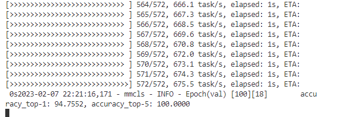

# README

## 作业一 mmclassification

### 基础作业



日志文件: slurm-285925.out，20230207_221004.log

配置文件：resnet18_b32_flower.py

模型文件：latest.pth

## openmmlab配置文件解释

```python
_base_=['../_base_/resnet18.py']
model = dict(
    head = dict(
        num_classes = 5,
        topk = (1, )
    )
)
```

num_classes: 分类数
topk: topk准确率 
top-1：预测的label取最后概率最大的那个，如果预测结果中概率最大的label和真实label相同，则预测正确，否则预测错误
top-5：预测的label取概率最大的5个，如果预测结果中概率最大的5个中包含真实label，则预测正确，否则预测错误
